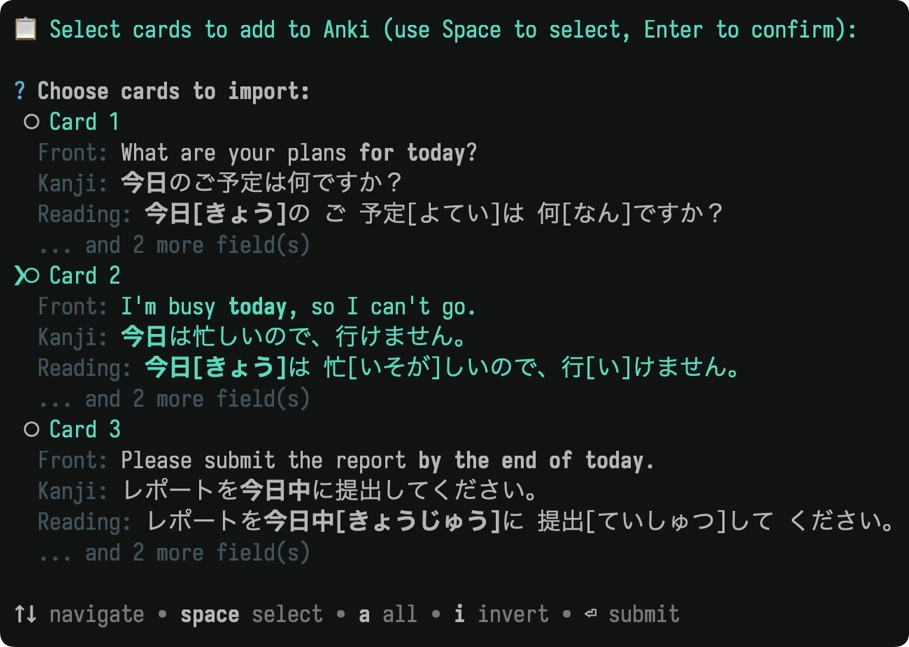
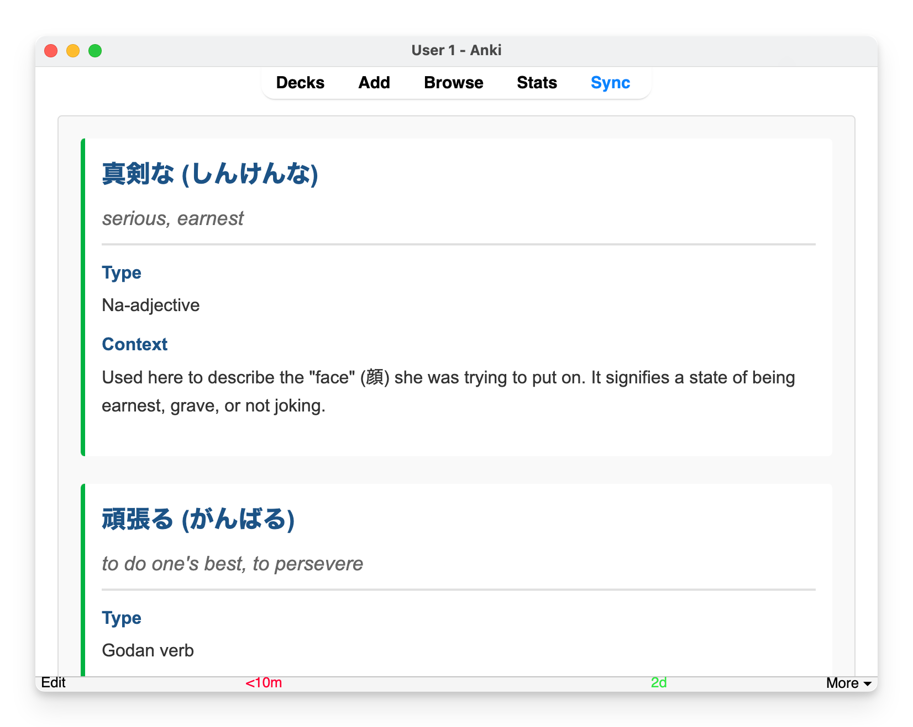

<p align="center">
  <picture>
    <source media="(prefers-color-scheme: dark)" srcset="meta/logo-dark.svg">
    
  </picture>
</p>

<p align="center">
  A CLI toolkit for bulk-processing and generating Anki flashcards with LLMs.
</p>

---

## Example workflows

- **Bulk-verify translations** – End-to-end pipeline for cleaning large decks.
  [Read more](#example-use-case-fixing-1000-japanese-translations)
- **Add a Key Vocabulary field** – Create a per-note field highlighting 1–3 key
  words with readings, meanings, and HTML context.
  [Read more](#example-use-case-adding-a-key-vocabulary-field)
- **Generate new cards** – Interactively create multiple contextual flashcards
  for a vocabulary word or concept from a single command.
  [Read more](#example-use-case-generating-new-vocabulary-cards)
- **Scriptable collection access** – Query AnkiConnect directly from the CLI or
  AI agents. [Command reference](#anki-llm-query-action-params)

## Why?

Manually editing hundreds or thousands of Anki cards is tedious, error-prone,
and time-consuming. Whether it's verifying translations, adding grammar notes,
or generating contextual examples, doing it by hand doesn't scale.

`anki-llm` provides a bridge between your Anki collection and modern AI models.

**Batch processing**

- **File-based**: _Export_ deck to file, _process_ with LLM, _import_ results
  back to Anki.
- **Direct**: Process and update notes in-place.

**Card generation**

Generate multiple contextual flashcard examples for a term, review
interactively, and add selected cards to your deck.

## Features

- **Batch processing workflows**: File-based (with resume) or direct-to-Anki (one
  command).
- **Export** Anki decks to clean CSV or YAML files.
- **Batch process** note fields using OpenAI or Google Gemini models.
- **Custom prompts**: Use flexible template files to define exactly how the LLM
  should process your cards.
- **Concurrent processing**: Make multiple parallel API requests to speed up
  large jobs.
- **Resilient**: Automatically retries failed requests and saves progress
  incrementally (file mode).
- **Automatic resume**: Pick up where you left off if processing is interrupted
  (file mode).
- **Copy mode**: Alternatively, generate cards without API keys by pasting LLM
  responses from browser interfaces (ChatGPT, Claude, etc.).

## Installation

Install globally via npm:

```bash
npm install -g anki-llm
```

## Requirements

- Node.js (v18 or higher)
- Anki Desktop must be running.
- The [AnkiConnect](https://ankiweb.net/shared/info/2055492159) add-on must be
  installed in Anki.

## API Configuration

`anki-llm` uses LLM APIs to process your notes. You need to configure an API key
for the model provider you want to use.

### Supported models

The tool supports two API providers:

| Model                    | Input   | Output   |                                                                          |
| ------------------------ | ------- | -------- | ------------------------------------------------------------------------ |
| **OpenAI models**        |
| `gpt-4.1`                | $2.50/M | $10.00/M | [🔗](https://platform.openai.com/docs/models/gpt-4.1)                    |
| `gpt-4o`                 | $2.50/M | $10.00/M | [🔗](https://platform.openai.com/docs/models/gpt-4o)                     |
| `gpt-4o-mini`            | $0.15/M | $0.60/M  | [🔗](https://platform.openai.com/docs/models/gpt-4o-mini)                |
| `gpt-5`                  | $1.25/M | $10.00/M | [🔗](https://platform.openai.com/docs/models/gpt-5)                      |
| `gpt-5-mini`             | $0.25/M | $2.00/M  | [🔗](https://platform.openai.com/docs/models/gpt-5-mini)                 |
| `gpt-5-nano`             | $0.05/M | $0.40/M  | [🔗](https://platform.openai.com/docs/models/gpt-5-nano)                 |
| **Google Gemini models** |
| `gemini-2.0-flash`       | $0.10/M | $0.40/M  | [🔗](https://ai.google.dev/gemini-api/docs/models#gemini-2.0-flash)      |
| `gemini-2.5-flash`       | $0.30/M | $2.50/M  | [🔗](https://ai.google.dev/gemini-api/docs/models#gemini-2.5-flash)      |
| `gemini-2.5-flash-lite`  | $0.10/M | $0.40/M  | [🔗](https://ai.google.dev/gemini-api/docs/models#gemini-2.5-flash-lite) |
| `gemini-2.5-pro`         | $1.25/M | $10.00/M | [🔗](https://ai.google.dev/gemini-api/docs/models#gemini-2.5-pro)        |

Pricing is per million tokens (M). Check the latest prices on the provider's
website to be sure.

### Setting up API Keys

Set the appropriate environment variable for your chosen model provider:

**For OpenAI models:**

```bash
export OPENAI_API_KEY="your-api-key-here"
```

Get your API key from: https://platform.openai.com/api-keys

**For Gemini models:**

```bash
export GEMINI_API_KEY="your-api-key-here"
```

Get your API key from: https://aistudio.google.com/api-keys

## Configuration

Use `anki-llm config` to store defaults (for example, the model) so you don't
have to repeat flags on every command.

```bash
# Set or override defaults
anki-llm config set model gpt-4o-mini
```

Config file lives at `~/.config/anki-llm/config.json`.

---

## Commands reference

- [`export`](#anki-llm-export-deck-output) - Export deck to file
- [`import`](#anki-llm-import-input) - Import data to deck
- [`process-file`](#anki-llm-process-file-input) - Process notes from file with AI
- [`process-deck`](#anki-llm-process-deck-deck) - Process notes from deck with AI
- [`generate-init`](#anki-llm-generate-init-output) - Create prompt template for generate
- [`generate`](#anki-llm-generate-term) - Generate new cards for a term
- [`query`](#anki-llm-query-action-params) - Query AnkiConnect API

### `anki-llm export <deck> [output]`

Exports notes from an Anki deck.

- `<deck>`: The name of the Anki deck to export (must be in quotes if it
  contains spaces).
- `[output]`: Optional output file path. If omitted, automatically generates a
  filename from the deck name (e.g., `"My Deck"` → `my-deck.yaml`). You can also
  provide just a file extension (e.g., `.csv`) to auto-generate the filename
  with your preferred format.

**Examples:**

```bash
# Auto-generate filename with default .yaml format
anki-llm export "Japanese Core 1k"
# → japanese-core-1k.yaml

# Auto-generate filename with .csv format
anki-llm export "Japanese Core 1k" .csv
# → japanese-core-1k.csv

# Specify custom filename
anki-llm export "Japanese Core 1k" my-custom-name.yaml
```

### `anki-llm import <input>`

Imports data from a file into an Anki deck. Existing notes (matched by key field)
are updated, while new entries create new notes.

- `<input>`: Path to the data file to import (CSV or YAML).

**Required options:**

- `-d, --deck`: The name of the target Anki deck.

**Common options:**

- `-n, --note-type`: The Anki note type to use when creating new notes. If not
  specified, it will be inferred from existing notes in the deck.
- `-k, --key-field`: Field to use for identifying existing notes. If not
  specified, auto-detects using this priority: (1) `noteId` column if present,
  (2) first field of the note type, (3) error if neither found.

---

### `anki-llm process-file <input>`

Batch-process notes from a CSV/YAML file using an LLM and user-defined prompts.
This command saves the transformed results to an output file and features
automatic resume, allowing it to safely skip completed notes if interrupted or
re-run.

- `<input>`: Input file path (CSV or YAML).

**Required options:**

- `-o, --output`: Output file path (CSV or YAML).
- `-p, --prompt`: Path to the prompt template text file.
- **Either** `--field` **or** `--json` (mutually exclusive):
  - `--field <name>`: Update a single field with the AI response.
  - `--json`: Expect JSON response and merge all fields into the note.
  - See [Understanding `--field` vs `--json` modes](#understanding---field-vs---json-modes) for more details.

**Common options:**

- `-m, --model`: AI model to use (required unless set via `config set model`).
- `-b, --batch-size`: Number of concurrent API requests (default: `5`).
- `-r, --retries`: Number of retries for failed requests (default: `3`).
- `-d, --dry-run`: Preview the operation without making API calls (recommended
  for testing).
- `-f, --force`: Re-process all rows, ignoring existing output.
- `--limit`: Limit the number of new rows to process (useful for testing prompts
  on a small sample before processing large datasets).
- `--require-result-tag`: Only extracts content from within `<result></result>`
  tags in the AI response.
- `--log`: Generate a log file with detailed debug information.
- `--very-verbose`: Log full LLM responses to the log file (automatically
  enables `--log`). Useful for debugging prompts and understanding model
  outputs.

**Workflow:**

1. Export deck to file: `anki-llm export "My Deck" notes.yaml`
2. Process file:
   `anki-llm process-file notes.yaml -o output.yaml --field Translation -p prompt.txt -m gpt-4o-mini`
3. Import results: `anki-llm import output.yaml -d "My Deck"`

**Examples:**

```bash
# Process a file and update a single field
anki-llm process-file notes.yaml -o output.yaml --field Translation -p prompt.txt -m gpt-4o-mini

# Process with JSON mode (update multiple fields)
anki-llm process-file notes.yaml -o output.yaml --json -p prompt.txt -m gpt-4o-mini

# Test on 10 notes first (dry run)
anki-llm process-file notes.yaml -o output.yaml --field Translation -p prompt.txt --limit 10 --dry-run -m gpt-4o-mini

# Resume processing after interruption (automatic - just re-run the same command)
anki-llm process-file notes.yaml -o output.yaml --field Translation -p prompt.txt -m gpt-4o-mini

# Force re-process all notes (ignore existing output)
anki-llm process-file notes.yaml -o output.yaml --field Translation -p prompt.txt --force -m gpt-4o-mini
```

**Key features:**

- ✅ **Automatic resume**: Skips already-processed notes
- ✅ **Incremental saves**: Progress saved continuously
- ✅ **Review before import**: You can inspect/edit the output file before
  importing

**When to use this command:**

This command provides a file-based workflow for batch processing notes. It is the primary alternative to the `process-deck` command, which modifies notes directly in your Anki collection.

Use `process-file` instead of `process-deck` when you:

- **Require a manual review step.** The command outputs to a file, creating a safe staging area to inspect results before you commit them to your Anki deck.
- **Need to process a large number of notes where interruptions are possible.** Its resume capability ensures you don't lose progress if the process fails midway.
- **Are operating in an environment without a running Anki instance.** This command is fully self-contained and does not need to connect to the Anki application.

---

### `anki-llm process-deck <deck>`

Batch-process notes directly from an Anki deck using an LLM and user-defined
prompts, updating them in-place. No intermediate files needed. This is faster
and more convenient when you've tested your prompt and know the end result is
safe to run.

- `<deck>`: Name of the Anki deck to process (must be in quotes if it contains
  spaces).

**Required options:**

- `-p, --prompt`: Path to the prompt template text file.
- **Either** `--field` **or** `--json` (mutually exclusive):
  - `--field <name>`: Update a single field with the AI response.
  - `--json`: Expect JSON response and merge all fields into the note.
  - See [Understanding `--field` vs `--json` modes](#understanding---field-vs---json-modes) for more details.

**Common options:**

- `-m, --model`: AI model to use (required unless set via `config set model`).
- `-b, --batch-size`: Number of concurrent API requests (default: `5`).
- `-r, --retries`: Number of retries for failed requests (default: `3`).
- `-d, --dry-run`: Preview the operation without making API calls (recommended
  for testing).
- `--limit`: Limit the number of notes to process (useful for testing prompts on
  a small sample before processing entire deck).
- `--require-result-tag`: Only extracts content from within `<result></result>`
  tags in the AI response.
- `--log`: Generate a log file with detailed debug information.
- `--very-verbose`: Log full LLM responses to the log file (automatically
  enables `--log`). Useful for debugging prompts and understanding model
  outputs.

**Prerequisites:**

- Anki Desktop must be running
- AnkiConnect add-on must be installed

**Workflow:**

- Single command:
  `anki-llm process-deck "My Deck" --field Translation -p prompt.txt -m gpt-4o-mini`

**Examples:**

```bash
# Process a deck directly and update a single field
anki-llm process-deck "Japanese Core 1k" --field Translation -p prompt.txt

# Direct mode with JSON (update multiple fields)
anki-llm process-deck "Vocabulary" --json -p prompt.txt

# Test on 10 notes first (recommended before processing entire deck)
anki-llm process-deck "My Deck" --field Notes -p prompt.txt --limit 10 --dry-run

# Use a different model for a specific run
anki-llm process-deck "Spanish" --field Translation -p prompt.txt
```

**Key features:**

- ✅ **No intermediate files**: Process and update in one step
- ✅ **Batch updates**: Efficient bulk updates to Anki
- ✅ **Error logging**: Failed notes logged to `[deck-name]-errors.jsonl`
- ❌ **No resume support**: Must complete in one run (use `process-file` for
  large datasets)

---

#### **Understanding `--field` vs `--json` modes**

Both `process-file` and `process-deck` support two response formats for the LLM:

- **`--field` mode** (single field update): The LLM response is saved to the
  specified field.

  ```bash
  anki-llm process-file notes.yaml -o out.yaml -p prompt.txt --field Translation
  ```

- **`--json` mode** (multi-field merge): The LLM must return valid JSON. All
  fields in the JSON are merged into your note.

  ```bash
  anki-llm process-file notes.yaml -o out.yaml -p prompt.txt --json
  ```

  Example: If your note has `Japanese` and `Grammar` fields, and the LLM
  returns:

  ```json
  {
    "Japanese": "こんにちは",
    "Grammar": "greeting"
  }
  ```

  Both fields will be updated. Only fields present in the JSON are updated
  (partial updates are allowed). If the response is not valid JSON, the
  operation will fail and retry.

---

### `anki-llm generate-init [output]`

Interactively creates a prompt template file for the `generate` command. The
wizard guides you through selecting a deck and note type, then uses an LLM to
analyze your existing cards and generate a tailored prompt that matches your
deck's style and formatting. This is the recommended way to get started with
card generation.

- `[output]`: Optional output file path. If omitted, automatically generates a
  filename from the deck name.

**Common options:**

- `-m, --model`: The LLM model to use for the smart prompt generation step
  (e.g., `gemini-2.5-pro`).
- `-t, --temperature`: Temperature for LLM generation (0.0-2.0, default varies
  by model). Lower values produce more consistent output.
- `--copy`: Copy the LLM prompt to clipboard and wait for manual response
  pasting. Useful when you don't have API access and want to use a browser LLM
  interface like ChatGPT.

<!-- prettier-ignore -->
> [!TIP]
> Using a more capable reasoning model like `gemini-2.5-pro` for the
> `generate-init` step can produce higher-quality prompt templates that better
> capture the nuances and style of your existing cards.

**Workflow:**

1. Run the wizard: `anki-llm generate-init`
2. Follow the interactive steps to select a deck and note type.
3. A prompt file (e.g., `my-deck-prompt.md`) is created for you.
4. Review and customize the generated prompt file.
5. Use the file with the `generate` command:
   `anki-llm generate "term" -p my-deck-prompt.md`

---

### `anki-llm generate <term>`

Generates multiple new Anki card examples for a given term, lets you review and
select which ones to keep, and adds them directly to your deck.

- `<term>`: The word or phrase to generate cards for (must be in quotes if it
  contains spaces).

**Required options:**

- `-p, --prompt`: Path to the prompt template file (created with
  `generate-init`).

**Common options:**

- `-c, --count`: Number of card examples to generate (default: `3`).
- `-m, --model`: AI model to use (defaults to `gpt-5-mini` or `gemini-2.5-flash`
  depending on your API key; can also be set via `config set model`).
- `-d, --dry-run`: Display generated cards without starting the interactive
  selection or import process.
- `-r, --retries`: Number of retries for failed requests (default: `3`).
- `-t, --temperature`: LLM temperature, a value between 0 and 2 that controls
  creativity (default: `1.0`).
- `--max-tokens`: Set a maximum number of tokens for the LLM response.
- `-o, --output`: Export cards to a file instead of importing to Anki (e.g.,
  `cards.yaml`, `cards.csv`).
- `--log`: Enable logging of LLM responses to a file (useful for debugging).
- `--copy`: Copy the LLM prompt to clipboard and wait for manual response
  pasting. Useful when you don't have API access and want to use a browser LLM
  interface like ChatGPT.

#### **Understanding the Prompt File**

The `--prompt` file is a text or markdown file that contains two parts: YAML
frontmatter for configuration and a prompt body with instructions for the LLM.

**Frontmatter (Required)**

The frontmatter is a YAML block at the top of the file enclosed by `---`.

- `deck`: The target Anki deck name.
- `noteType`: The name of the Anki note type (model) to use.
- `fieldMap`: Maps the keys from the LLM's JSON output to your actual Anki field
  names. The LLM will be instructed to generate JSON with the keys on the left,
  and `anki-llm` will use them to populate the Anki fields on the right.
- `qualityCheck` (optional): Enables automatic verification that generated
  cards contain natural-sounding sentences. Added automatically by
  `generate-init` when you enable this feature.

##### Optional: Quality Check

When running `generate-init`, the wizard will ask if you want to enable automatic
quality verification. If enabled, after you select cards, the tool will check
each one using an LLM and flag any that have quality issues for your review.

**Setup (automatic):**

The `generate-init` wizard will:

1. Ask if you want to enable the quality check
2. Let you choose which field to check for quality
3. Automatically include a generic prompt that works for any language (no
   customization needed)

After you select cards during generation, each one is checked via an additional
API call. Any cards flagged for quality issues are shown for review with the
LLM's reasoning, and you can decide whether to keep or discard them.

**Manual customization (optional):**

If you need language-specific requirements (e.g., checking formality in
Japanese), you can edit the `qualityCheck` section in your generated prompt
file. You can also specify a different (typically cheaper) model for quality
checks. The section looks like this:

```yaml
qualityCheck:
  field: jp
  model: gpt-4o-mini # Optional: use a cheaper model for checks
  prompt: |
    You are an expert native speaker. Evaluate if the following text sounds natural and well-written in its language.
    Text: {text}

    Consider grammar, syntax, word choice, and common phrasing.

    Respond with JSON only, with no additional text or explanations outside the JSON structure.
    Your response must be a JSON object with two keys:
    - "is_valid": a boolean (true if natural, false if unnatural).
    - "reason": a brief, one-sentence explanation for your decision.
```

**Cost considerations:**

Each selected card requires one additional API call for the quality check. You
can can use a cheaper model (like `gpt-4o-mini`) for quality checks by adding a
`model` field to the `qualityCheck` section. If not specified, it will use the
same model as card generation.

**Prompt Body**

The body contains your instructions for the LLM. It must:

1. Include the `{term}` placeholder, which will be replaced by the `<term>` you
   provide on the command line.
2. Include the `{count}` placeholder, which will be replaced by the number of
   cards requested.
3. Instruct the LLM to return a JSON array of objects, where each object
   represents one card and uses the keys defined in `fieldMap`.
4. Include a "one-shot" example showing the exact JSON array structure and
   desired formatting (e.g., HTML for bolding or lists).
5. Encourage the LLM to generate diverse cards that highlight different nuances,
   contexts, or usage examples of the term.

**Example Prompt File (`japanese-vocab-prompt.md`)**

````markdown
---
deck: Japanese::Vocabulary
noteType: Japanese (recognition)
fieldMap:
  en: English
  jp: Japanese
  context: Context
---

You are an expert assistant who creates {count} distinct Anki flashcards for a
Japanese vocabulary word. The term to create cards for is: **{term}**

IMPORTANT: Your output must be a single, valid JSON array of objects and nothing
else. Each object in the array should represent a unique flashcard. All field
values must be strings.

Follow the structure shown in this example precisely:

```json
[
  {
    "en": "How was your day?",
    "jp": "今日はどうでしたか？",
    "context": "A natural and common way to ask about someone's day politely. You can say 「今日どうだった？」 in casual speech."
  }
]
```

Return only a valid JSON array matching this structure. Ensure you generate
{count} varied and high-quality cards that highlight different nuances, contexts,
or usage examples of the term.
````

#### Using `--copy` Mode (Manual LLM Workflow)

The `--copy` flag allows you to generate cards without API keys by manually
copying prompts to a browser-based LLM interface (like ChatGPT, Claude, Gemini,
etc.) and pasting responses back.

**Workflow:**

1. Run the command with `--copy`:
   ```bash
   anki-llm generate "今日" -p prompt.md --copy
   ```
2. The program automatically copies the LLM prompt to your clipboard.
3. Paste the prompt into your preferred LLM interface (ChatGPT, Claude, etc.).
4. Copy the complete JSON response from the LLM.
5. Paste it into the terminal.
6. Type `END` on a new line and press Enter to submit.
7. The program validates and processes your cards normally.

**Benefits:**

- No API key required
- Use any LLM interface you prefer
- Works with free-tier LLM services
- Full control over the LLM interaction

**Examples:**

```bash
# Generate 3 cards for a term using a prompt file
anki-llm generate "新しい" -p japanese-vocab-prompt.md

# Generate 5 cards and preview them without importing
anki-llm generate "ambiguous" -p english-vocab-prompt.md --count 5 --dry-run

# Use a different model for a specific run
anki-llm generate "maison" -p french-prompt.md -m gemini-2.5-pro

# Generate cards and export to YAML for later review/import
anki-llm generate "今日" -p japanese-vocab-prompt.md -o cards.yaml

# Import the exported cards when ready
anki-llm import cards.yaml --deck "Japanese::Vocabulary"

# Enable logging for debugging
anki-llm generate "新しい" -p prompt.md --log

# Use manual copy-paste mode (no API key required)
anki-llm generate "今日" -p japanese-vocab-prompt.md --copy
```



**Key features:**

- ✅ **Interactive selection**: Review and choose which generated cards to keep.
- ✅ **Duplicate detection**: Automatically flags cards that may already exist
  in your deck.
- ✅ **Export option**: Save generated cards to YAML/CSV for review before
  importing.
- ✅ **Highly customizable**: Full control over card generation via the prompt
  file.

---

### `anki-llm query <action> [params]`

Query the AnkiConnect API directly with any supported action. This command is
especially useful for AI agents (like Claude Code) to explore and interact with
your Anki collection programmatically.

- `<action>`: The AnkiConnect API action to perform (e.g., `deckNames`,
  `findNotes`, `cardsInfo`).
- `[params]`: Optional JSON string of parameters for the action.

**Why this is useful for AI agents:**

AI assistants can use this command to dynamically query your Anki collection
without you having to manually provide information. For example:

- "List all my decks" → `anki-llm query deckNames`
- "Show me statistics for my Japanese deck" →
  `anki-llm query getDeckStats '{"decks":["Japanese"]}'`
- "Find all cards with tag 'vocabulary'" →
  `anki-llm query findNotes '{"query":"tag:vocabulary"}'`

The command outputs clean JSON that AI agents can parse and reason about, making
it easy to build custom workflows or answer questions about your Anki
collection.

**Examples:**

```bash
# Get all deck names
anki-llm query deckNames

# Get all model (note type) names
anki-llm query modelNames

# Find notes in a specific deck
anki-llm query findNotes '{"query":"deck:Japanese"}'

# Get detailed information about specific cards
anki-llm query cardsInfo '{"cards":[1498938915662]}'

# Get statistics for a deck
anki-llm query getDeckStats '{"decks":["Default"]}'

# Check AnkiConnect version
anki-llm query version

# Get full AnkiConnect API documentation (useful for AI agents to understand available actions)
anki-llm query docs
```

**Example: Sampling random cards from decks**

AI agents can use `anki-llm query` to discover information about your
collection and then take action. Here's an example of Claude Code using the
`query` command to sample random cards from multiple decks. Given the
instruction: "Use anki-llm to pick random cards from Glossika decks, and print
the English and Japanese fields for each, pick 10 cards from each deck, and
save to a markdown file"

[Full conversation](https://gist.github.com/raine/b8d42275a188005bd2dadc34b8e05824)

This demonstrates how the `query` command enables AI agents to build custom
scripts for data analysis and extraction tasks autonomously.

**Special actions:**

- `docs` or `help`: Returns the complete AnkiConnect API documentation. This is
  especially useful for AI agents that need to understand what actions are
  available and how to use them. The agent can query this once to get the full
  documentation and then use that context to make informed decisions about which
  API calls to make.

See [ANKI_CONNECT.md](./ANKI_CONNECT.md) for the complete list of available
actions and their parameters.

## Example use case: Fixing 1000 Japanese translations

Let's say you have an Anki deck named "Japanese Core 1k" with 1000 notes. Each
note has a `Japanese` field with a sentence and a `Translation` field with an
English translation that you suspect is inaccurate. We'll use `anki-llm` and
GPT-4o mini to generate better translations for all 1000 notes.

### Step 1: Export your deck

First, export the notes from your Anki deck into a YAML file. YAML is great for
multiline text fields and for using `git diff` to see what has changed after
processing is complete.

```bash
anki-llm export "Japanese Core 1k" notes.yaml
```

This command will connect to Anki, find all notes in that deck, and save them to
a YAML file.

```
============================================================
Exporting deck: Japanese Core 1k
============================================================

✓ Found 1000 notes in 'Japanese Core 1k'.

Discovering model type and fields...
✓ Model type: Japanese Model
✓ Fields: Japanese, Translation, Reading, Sound, noteId

Fetching note details...
✓ Retrieved information for 1000 notes.

Writing to notes.yaml...
✓ Successfully exported 1000 notes to notes.yaml
```

The `notes.yaml` file will look something like this:

```yaml
- noteId: 1512345678901
  Japanese: 猫は机の上にいます。
  Translation: The cat is on the desk.
- noteId: 1512345678902
  Japanese: 彼は毎日公園を散歩します。
  Translation: He strolls in the park every day.
# ... 998 more notes
```

### Step 2: Create a prompt template

Next, create a prompt file (`prompt-ja-en.txt`) to instruct the AI. Use
`{field_name}` syntax for variables that will be replaced with data from each
note. We want to process the `Japanese` field.

**File: `prompt-ja-en.txt`**

```
You are an expert Japanese-to-English translator.

Translate this Japanese sentence to English: {Japanese}

Guidelines:
- Translate accurately while preserving nuance and meaning.
- Be natural and idiomatic in English.
- If possible, structure the English so the original Japanese grammar can be inferred.

Instructions:
1. First, analyze the sentence structure and key elements.
2. Think through the translation choices and any nuances.
3. Provide your final translation wrapped in <result></result> XML tags.

Format your response like this:
- Analysis: [your analysis of the sentence]
- Translation considerations: [your thought process]
- <result>[your final English translation here]</result>
```

<!-- prettier-ignore -->
> [!NOTE]
> The `<result>` tag (used with `--require-result-tag`) is optional. You could instruct the LLM to respond with only the translation directly. However, asking the model to "think out loud" by analyzing the sentence first tends to produce higher-quality translations, as it encourages deeper reasoning before generating the final output.

### Step 3: Run the process-file command

Now, run the `process-file` command. We'll tell it to use our `notes.yaml` file
as input, write to a new `notes-translated.yaml` file, process the `Translation`
field, and use our prompt template.

The tool will read the `Japanese` field from each note to fill the prompt, then
the AI's response will overwrite the `Translation` field.

```bash
anki-llm process-file notes.yaml \
  --output notes-translated.yaml \
  --field Translation \
  --prompt prompt-ja-en.txt \
  --model gemini-2.5-flash \
  --batch-size 10 \
  --require-result-tag
```

- `notes.yaml`: The input file.
- `--output notes-translated.yaml`: The output file.
- `--field Translation`: The field we want the AI to generate and place its
  result into.
- `--prompt prompt-ja-en.txt`: Our instruction template.
- `--model gemini-2.5-flash`: The AI model to use.
- `--batch-size 10`: Process 10 notes concurrently for speed.
- `--require-result-tag`: Ensures the tool only saves the content inside the
  `<result>` tag, ignoring the AI's analysis.

You will see real-time progress as it processes the notes:

```
============================================================
File-Based Processing
============================================================
Input file:        notes.yaml
Output file:       notes-translated.yaml
Field to process:  Translation
Model:             gpt-4o-mini
Batch size:        10
...
============================================================

Reading notes.yaml...
✓ Found 1000 rows in YAML

Loading existing output...
✓ Found 0 already-processed rows

Processing 1000 rows...
Processing |████████████████████████████████████████| 100% | 1000/1000 rows | Cost: $0.0234 | Tokens: 152340

✓ Processing complete

============================================================
Summary
============================================================
- Successes:         1000
- Failures:          0
- Total Processed:   1000
- Total Time:        85.32s
- Model:             gpt-4o-mini
- Dry Run:           false
---
- Total Tokens:      152,340
- Input Tokens:      120,100
- Output Tokens:     32,240
- Est. Cost:         $0.02
============================================================
```

### Step 4: Import the changes

The final step is to import the newly generated translations back into Anki. The
tool uses the `noteId` to find and update the existing notes.

```bash
anki-llm import notes-translated.yaml --deck "Japanese Core 1k"
```

- `notes-translated.yaml`: The file with our improved translations.
- `--deck "Japanese Core 1k"`: The destination deck.

The model type will be automatically inferred from the existing notes in the
deck. You can also explicitly specify it with `--model "Japanese Model"` if
needed.

```
============================================================
Importing from notes-translated.yaml to deck: Japanese Core 1k
Model: Japanese Model
Key field: noteId
============================================================

✓ Found 1000 rows in notes-translated.yaml.

✓ Valid fields to import: Japanese, Translation, Reading, Sound

✓ Found 1000 existing notes with a 'noteId' field.

✓ Partitioning complete:
  - 0 new notes to add.
  - 1000 existing notes to update.

Updating 1000 existing notes...
✓ Update operation complete: 1000 notes updated successfully.

Import process finished.
```

That's it! All 1000 notes in your Anki deck have now been updated with
high-quality translations.

## Example use case: Adding a "Key Vocabulary" field

Sentence flashcards often benefit from a focused vocabulary breakdown. You can
use `anki-llm` to populate a dedicated `Key Vocabulary` field with structured
HTML that spotlights the most important words in each sentence.

<p align="center">
  
</p>

### Prompt template

Create a prompt that instructs the model to reason about the sentence, pick the
top 1–3 items, and return clean HTML. This example assumes your notes have
`Japanese` and `English` fields. You can start from the full prompt example in
[`examples/key_vocabulary.md`](examples/key_vocabulary.md).

**File: `prompt-key-vocab.txt`**

```
You are an expert Japanese vocabulary AI assistant designed for language learners. Your primary role is to analyze Japanese sentences, identify the most significant vocabulary words, and produce clear, concise, and educational explanations formatted in clean, semantic HTML.

The user is an intermediate learner who uses sentence flashcards to practice. Your output will populate a "Key Vocabulary" field on their Anki flashcard. The HTML you generate must be well-structured to allow for easy and flexible styling with CSS.

English: {English}
Japanese: {Japanese}

Analysis: Explain which vocabulary items you chose and why they matter for an intermediate learner.
Always produce between 1 and 3 key vocabulary entries using the following HTML structure (use dictionary form in the heading and include the kana reading in parentheses):

<h3>WORD (reading)</h3>
<dl class="vocab-entry">
  <dt>Type</dt>
  <dd>Part of speech</dd>

  <dt>Meaning</dt>
  <dd>Concise English definition</dd>

  <dt>Context</dt>
  <dd>Sentence-specific explanation, including any conjugation or nuance notes.</dd>
</dl>

Replace the placeholder content with the actual vocabulary analysis. Within the `<result>` tags, output only the completed HTML entries with no additional commentary.

<result>
</result>
```

### Run the processor

Process your exported notes and overwrite the `Key Vocabulary` field with the
HTML generated by the prompt:

```bash
anki-llm process-file sentences.yaml \
  --output sentences-key-vocab.yaml \
  --field "Key Vocabulary" \
  --prompt prompt-key-vocab.txt \
  --model gemini-2.5-flash-lite \
  --require-result-tag
```

- `--field "Key Vocabulary"`: Updates that specific field on each note.
- `--require-result-tag`: Keeps only the HTML between `<result>` tags and drops
  the analysis from the prompt.

### Sample output snippet

When you open the processed YAML/CSV, the generated field will look like this:

```yaml
Key Vocabulary: |
  <h3>控える (ひかえる)</h3>
  <dl class="vocab-entry">
    <dt>Type</dt>
    <dd>Ichidan verb</dd>

    <dt>Meaning</dt>
    <dd>To refrain; to hold back</dd>

    <dt>Context</dt>
    <dd>Appears as 控えていて, the te-form plus いる to show an ongoing act of self-restraint in the scene.</dd>
  </dl>

  <h3>さっぱり (さっぱり)</h3>
  <dl class="vocab-entry">
    <dt>Type</dt>
    <dd>Adverb</dd>

    <dt>Meaning</dt>
    <dd>Completely; entirely (with a nuance of 'not at all' when paired with negatives)</dd>

    <dt>Context</dt>
    <dd>Modifies わからない to emphasize that the speaker has absolutely no understanding.</dd>
  </dl>
```

After verifying the results, import the updated file back into Anki to add the
structured vocabulary explanations to your cards.

## Example use case: Generating new vocabulary cards

Let's create several new example flashcards for the Japanese word `会議`
(meeting) and add them to our "Japanese::Vocabulary" deck.

### Step 1: Create a prompt template with `generate-init`

First, run the `generate-init` wizard. It will ask you to select your deck and
note type, then use an LLM to analyze your existing cards and generate a prompt
file tailored to your collection.

```bash
anki-llm generate-init
```

Follow the interactive prompts. The wizard will use an AI model (defaults to
`gpt-5` or `gemini-2.5-flash` depending on your API key) to analyze existing
cards in your deck and create a smart prompt that matches their style and
formatting. When it's done, it will save a new file, for example
`japanese-vocabulary-prompt.md`.

The generated file will look something like this:

**File: `japanese-vocabulary-prompt.md`**

````markdown
---
deck: Japanese::Vocabulary
noteType: Japanese (recognition)
fieldMap:
  en: English
  jp: Japanese
  context: Context
---

You are an expert Japanese language assistant. Your goal is to create {count}
distinct, high-quality, contextual Anki flashcards for a vocabulary term. The
term to create cards for is: **{term}**

IMPORTANT: Your output must be a single, valid JSON array of objects and nothing
else. Each object in the array should represent a unique flashcard. All field
values must be strings. Use `<b>` tags to highlight the term in the example
sentence.

Follow the structure shown in this example precisely:

```json
[
  {
    "en": "The <b>meeting</b> is scheduled for 3 PM.",
    "jp": "<b>会議</b>は午後3時に予定されています。",
    "context": "Used in a formal business context."
  }
]
```

Return only a valid JSON array matching this structure. Ensure you generate
{count} varied cards that highlight different nuances, contexts, or usage
examples of the term.
````

You can now edit this file to further refine the instructions for the AI.

### Step 2: Generate cards for your term

Now, use the `generate` command with your new prompt file to create card
examples for `会議`.

```bash
anki-llm generate "会議" -p japanese-vocabulary-prompt.md -m gemini-2.5-flash
```

The tool will make a single API call asking the LLM to generate 3 distinct cards
and show progress:

```
🔄 Generating 3 card candidates for "会議"...
✓ Generation complete: 3 succeeded, 0 failed
  Cost: $0.0027 (930 input + 954 output tokens)

🔍 Checking for duplicates...
```

### Step 3: Select which cards to import

After generation, an interactive checklist appears in your terminal. You can use
the arrow keys and spacebar to select the cards you want to add to Anki.

```
📋 Select cards to add to Anki (use Space to select, Enter to confirm):

❯ ◯ Card 1
│     English: The *meeting* was very productive.
│     Japanese: その*会議*は非常に生産的でした。
│     Context: General business context.
│
│ ◯ Card 2
│     English: I have a *meeting* with a client tomorrow.
│     Japanese: 明日、クライアントとの*会議*があります。
│     Context: A common phrase for scheduling.
│
│ ◯ Card 3 (⚠️  Duplicate)
│     English: The *meeting* is scheduled for 3 PM.
│     Japanese: *会議*は午後3時に予定されています。
│     Context: Used in a formal business context.
```

Here, we see three options. Card 3 has been flagged as a potential duplicate
because a similar card already exists in the deck. Let's select the first two
cards and press Enter.

### Step 4: Confirm the import

The selected cards are immediately added to your Anki deck.

```
📥 Adding 2 card(s) to Anki...

✓ Successfully added 2 new note(s) to "Japanese::Vocabulary"
```

That's it! You have successfully generated, reviewed, and imported multiple
high-quality, contextual Anki cards from a single command.

## Development

### Running locally

Use `tsx` to run the CLI directly from TypeScript source without rebuilding:

```bash
pnpm tsx src/cli.ts export "My Deck" notes.yaml
```

### Testing the global CLI

Use `pnpm link` to test the command globally:

```bash
pnpm link --global
anki-llm export "My Deck" notes.yaml
```

Note: The linked command uses compiled JavaScript from `dist/`. Run
`pnpm run build` after making changes to see them reflected.

To unlink: `pnpm unlink --global`

### Code quality

```bash
pnpm run check
```
